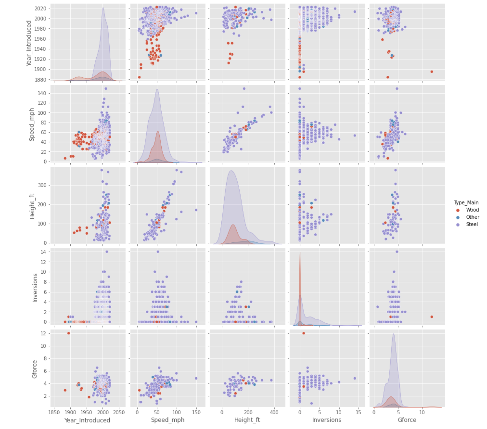
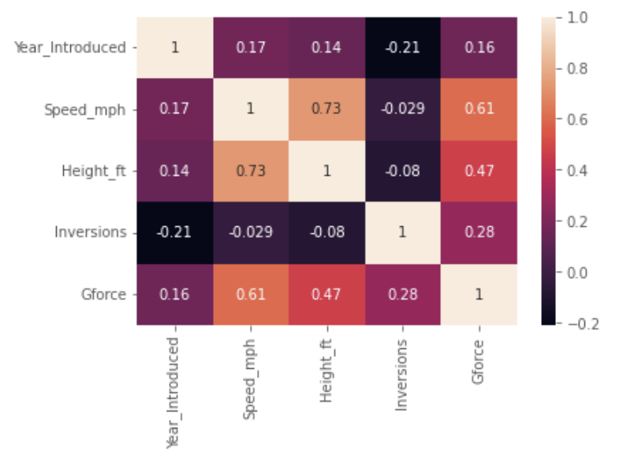
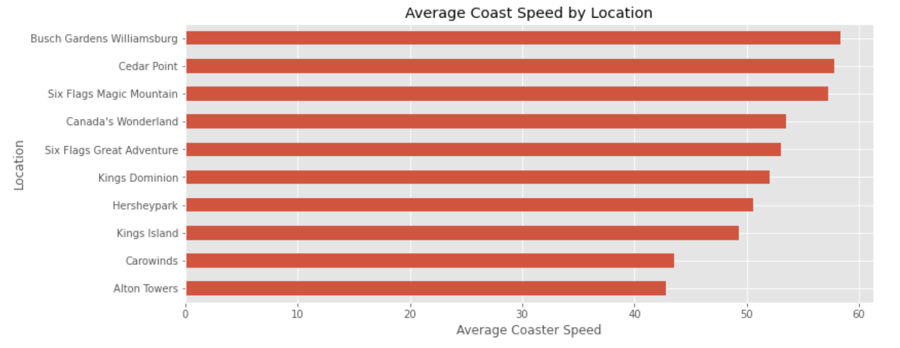

## 🎢 **Exploratory Data Analysis on Roller Coaster Dataset**
This project performs Exploratory Data Analysis (EDA) on a Roller Coaster dataset to explore trends and relationships among coaster characteristics such as speed, height, inversions, G-force, year introduced, and location.
The main goal is to uncover how coaster designs have evolved over time, what drives their speed and intensity, and which parks lead in pushing coaster engineering limits.

## 🧰 Tools & Libraries

- Python
- Pandas – Data cleaning, wrangling, and transformation
- NumPy – Statistical and numerical operations
- Matplotlib & Seaborn – Exploratory and comparative visualizations

## 📊 Key Analysis Steps

- Data Understanding – Explored data structure, types, and summary statistics.
- Data Preparation – Removed duplicates, handled missing values, and renamed columns for clarity.
- Feature Analysis – Examined distributions of features such as speed, height, and inversions.
- Feature Relationships – Investigated correlations and multivariate relationships using scatterplots, pairplots, and heatmaps.
- Insights Generation – Asked targeted questions like: “Which locations have the fastest roller coasters (with at least 10 entries)?”

---

## 📸 Screenshots

### Pairplot Analysis

This pairplot visualizes relationships between key features — Year Introduced, Speed (mph), Height (ft), Inversions, and G-force, grouped by coaster type (Wood, Steel, Other).

- Steel coasters dominate higher speeds and greater heights.
- Wooden coasters tend to be slower and shorter, with minimal inversions.
- A positive correlation exists between height and speed, while G-force shows weaker but varied relationships with other factors.

### Correlation Heatmap

The heatmap highlights correlations between numerical features such as Height, Speed, Inversions, and G-force.

- A strong positive correlation between height and speed, indicating taller coasters generally achieve higher speeds.
- Inversions show a moderate correlation with both speed and G-force, suggesting that more complex coaster designs tend to produce stronger forces.
- Year introduced has weaker correlations, reflecting that coaster innovation varies more by design type than time alone.

### Step 5: Asking a Question

This visualization answers the question by showing the top 10 amusement park locations with the highest average coaster speeds.

---

## 📊 Final Insights

From the exploratory data analysis, several key trends emerged:

- Coaster Speed and Height are strongly correlated — taller coasters generally reach higher speeds.
- Steel coasters dominate modern designs, offering higher speeds, more inversions, and greater G-forces compared to wooden ones.
- The popularity of roller coasters has evolved over time, with a significant rise in advanced steel coasters after 1990.
- Locations like Busch Gardens Williamsburg and Six Flags Magic Mountain consistently feature some of the fastest coasters, suggesting a focus on high-intensity experiences.
- Coasters with more inversions and higher G-forces tend to appear in more recent years, reflecting technological progress and changing consumer demand.

## 💡 Recommendations

- Parks aiming to attract thrill-seekers should invest in high-speed, tall steel coasters with multiple inversions to remain competitive.
- Wooden coasters could be marketed as nostalgic or family-friendly attractions to appeal to a different audience segment.

